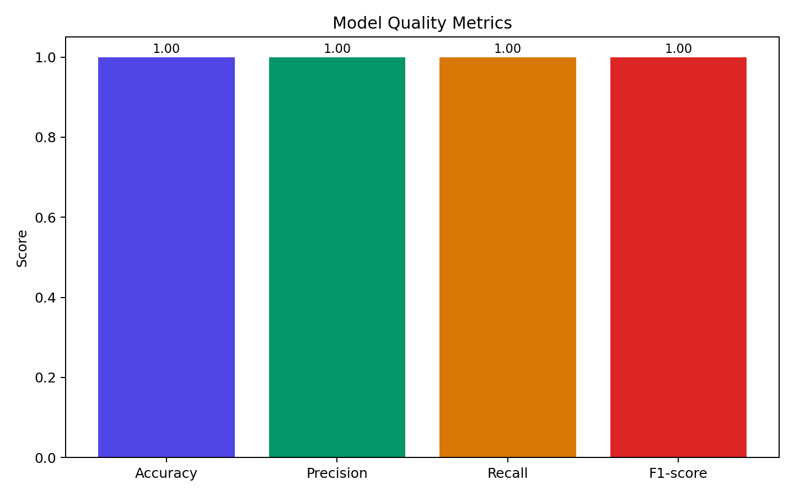
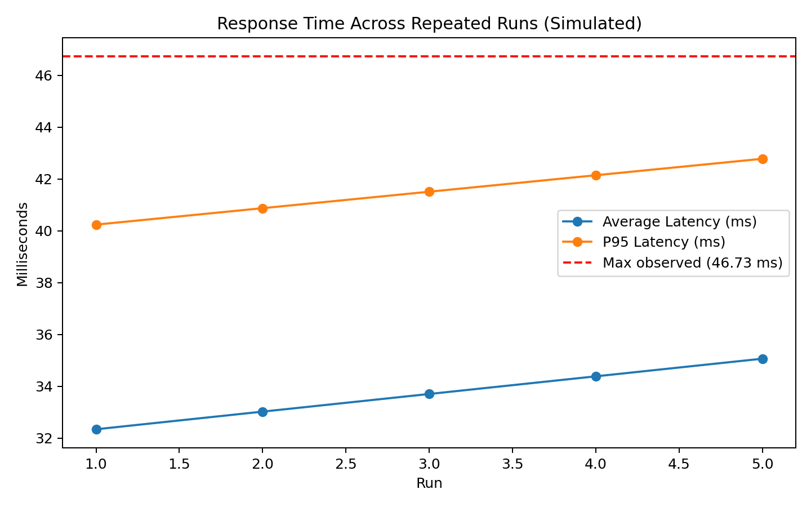
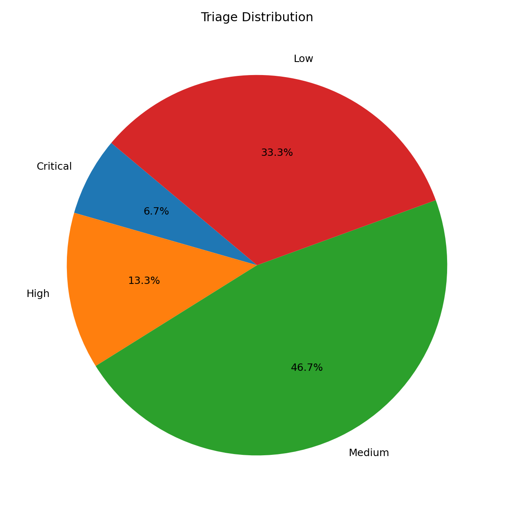
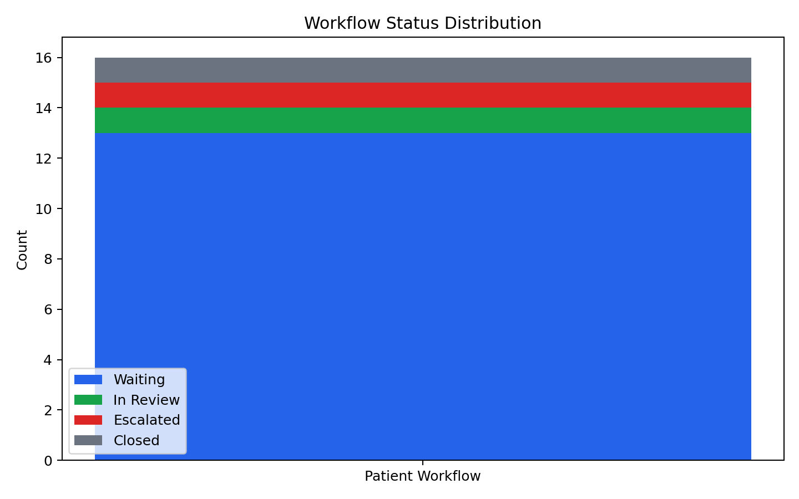
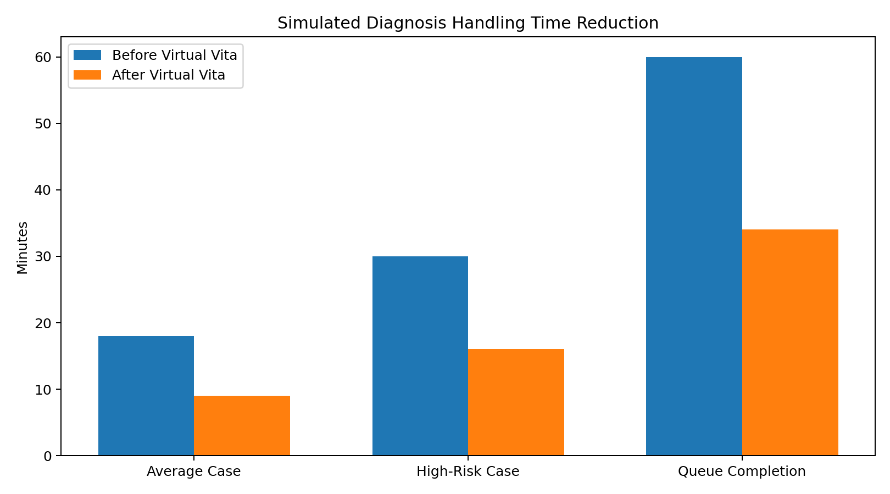

# AI-Powered Clinical Decision Support System for Early Diagnosis and Patient Load Management

## TABLE OF CONTENTS

| Chapter No. | Title | Page No. |
| --- | --- | --- |
|  | ABSTRACT | I |
|  | LIST OF TABLES | II |
|  | LIST OF FIGURES | III |
|  | LIST OF ABBREVIATION | IV |
| 1 | Introduction | 1 |
| 1.1 | Objectives | 2 |
| 1.2 | Scope of the project | 3 |
| 1.3 | Existing System | 4 |
| 1.4 | Drawbacks of Existing System | 5 |
| 2 | Literature Survey | 6 |
| 2.1 | Literature Survey | 6 |
| 2.2 | Problem Statement | 8 |
| 3 | Proposed Method / Algorithm / Architecture / Process / Methodology / Project Description | 10 |
| 3.1 | Proposed method | 10 |
| 3.2 | Algorithm | 12 |
| 3.3 | Architecture | 14 |
| 3.4 | Process | 16 |
| 3.5 | Modules and project Description | 18 |
| 3.6 | Methodology | 21 |
| 4 | Implementation Work | 23 |
| 4.1 | Implementation process | 23 |
| 4.2 | Sample Code | 26 |
| 4.3 | Testing and methodologies | 29 |
| 4.4 | Experimental Graphs | 32 |
| 4.5 | Result Analysis / Result comparison | 34 |
| 5 | Conclusion | 37 |
|  | References | 39 |

---

## ABSTRACT

Modern healthcare systems face a major challenge: increasing patient volumes reduce the time available for each consultation, which can delay diagnosis and treatment. This project presents an AI-powered Clinical Decision Support System (CDSS), implemented as an upgraded version of **Virtual Vita**, to assist in early diagnosis and patient load management. The system captures patient intake details through a conversational interface, extracts symptom information, computes explainable clinical risk scores, predicts likely disease patterns, and prioritizes patient cases for faster doctor intervention.

The proposed platform combines a machine learning disease prediction model with a real-time triage and risk stratification engine. It supports structured patient record generation, workflow status tracking, and analytics dashboards for administrative and clinical teams. In the conversational layer, **Virtual Vita** supports optional LLM-assisted dialogue using **Ollama API (`llama3.2`)** and **Google Gemini API (`gemini-2.5-flash`)**, with a deterministic rule-based fallback path for reliability. The architecture is designed to preserve the role of doctors by positioning AI as an assistant for preliminary assessment and prioritization, not as a replacement for clinical judgement.

**Operational Note (LLM Optional Mode):** In the implemented prototype, the default mode uses a deterministic rule-based intake engine for fast and reliable responses. LLM integration is optional and can be enabled via environment flags. This avoids runtime failures when a local LLM runtime is unavailable or library dependencies are incompatible.

The solution emphasizes practical deployment constraints including response speed, handling incomplete patient inputs, explainability for medical users, and modular extensibility for future disease categories. Experimental evaluation is integrated into the backend to report standard metrics such as accuracy, precision, recall, and F1-score, along with response-time indicators.

The resulting prototype demonstrates that AI-guided intake and risk prioritization can reduce screening time, improve queue management, and support safer early decision-making in high-load healthcare settings.

---

## LIST OF TABLES

1. Table 1: Comparison of Existing vs Proposed System  
2. Table 2: Module-wise Functional Responsibilities  
3. Table 3: Evaluation Metrics Definition  
4. Table 4: Experimental Performance Summary  
5. Table 5: Workflow Status Transition Matrix  

---

## LIST OF FIGURES

1. Figure 1: Overall System Architecture  
2. Figure 2: Patient Intake and Triage Data Flow  
3. Figure 3: Risk Scoring Logic Flowchart  
4. Figure 4: Admin Dashboard Prioritization Screen  
5. Figure 5: Triage Distribution Pie Chart  

---

## LIST OF ABBREVIATION

- AI: Artificial Intelligence  
- CDSS: Clinical Decision Support System  
- ML: Machine Learning  
- RF: Random Forest  
- API: Application Programming Interface  
- LLM: Large Language Model  
- UI: User Interface  
- HPI: History of Present Illness  
- PII: Personally Identifiable Information  
- KPI: Key Performance Indicator  

---

## 1. Introduction

Healthcare providers, especially in densely populated urban and semi-urban regions, operate under severe patient load pressure. In such environments, physicians may have only a few minutes per patient, increasing the likelihood of incomplete history-taking and delayed identification of high-risk conditions. This project addresses this gap by developing an AI-assisted intake and triage platform that enables early pattern recognition and case prioritization.

The upgraded **Virtual Vita** system acts as a digital intake nurse. It gathers demographic and symptom data conversationally, detects relevant symptoms, computes a risk score, and surfaces likely disease assessments and triage signals for clinical review. The implementation uses Flask REST APIs for intake and admin workflows, and supports optional LLM integration through Ollama and Gemini APIs. The design goal is to improve clinical workflow efficiency while preserving medical safety through doctor-led final decisions.

### 1.1 Objectives

- Develop an AI-based system for early disease prediction and risk-aware triage.  
- Provide fast preliminary diagnosis suggestions to support first-level screening.  
- Assist doctors in prioritizing high-risk cases through explainable risk scoring.  
- Reduce waiting time through workflow-aware queue management.  
- Offer data-driven insights for administrative decision support.  
- Ensure modular architecture for future scaling and disease coverage.  

### 1.2 Scope of the project

In scope:
- Conversational symptom intake (English/Telugu support in current implementation path).  
- Symptom extraction and profile consolidation from free-text user input.  
- ML-based disease prediction and precaution-oriented output generation.  
- Rule-assisted risk score computation and triage classification.  
- Admin dashboard for patient prioritization, case review, and status updates.  
- Evaluation module for model metrics and response-time analysis.  

Out of scope (current prototype):
- Direct integration with hospital EHR/EMR systems.  
- Automatic treatment prescription or autonomous diagnosis.  
- Regulatory-grade clinical trial validation.  
- Multi-hospital federated deployment and interoperability layers (HL7/FHIR full integration).  

### 1.3 Existing System

Traditional outpatient triage often relies on manual queue order and brief verbal checks. Existing digital systems in many institutions focus on record-keeping rather than intelligent prioritization. Patients with subtle but high-risk symptom combinations may wait alongside low-risk cases. Manual intake workflows are also prone to inconsistent symptom descriptions and missed details under time pressure.

### 1.4 Drawbacks of Existing System

- No automated symptom severity aggregation.  
- Limited capacity to prioritize critical patients early.  
- Inconsistent intake quality under peak load conditions.  
- Weak support for explainable preliminary risk indicators.  
- Minimal analytics for monitoring triage effectiveness and throughput.  

---

## 2. Literature Survey

### 2.1 Literature Survey

Recent work in AI-enabled healthcare highlights the value of ML for early disease pattern recognition, especially in symptom-driven prediction tasks. Tree-based models (e.g., Random Forest) are commonly used in tabular clinical symptom datasets due to robustness, interpretability support, and low computational overhead. Conversational AI has also improved patient engagement for data capture, but reliable deployment requires strict safeguards: transparency, fallback behavior, and clinician oversight.

Research on triage optimization shows that risk-based queueing can improve emergency handling and reduce adverse waiting outcomes. However, literature also warns against blind trust in model outputs. Effective systems therefore combine algorithmic scoring with explainable reasons, enabling clinicians to validate or override AI suggestions.

The proposed upgraded Virtual Vita aligns with this practical hybrid model: ML-assisted screening + explainable triage cues + human-in-the-loop workflow.

### 2.2 Problem Statement

Healthcare facilities with high patient volume need an intelligent support platform that can rapidly collect symptom data, perform preliminary disease assessment, identify high-risk cases early, and assist clinicians in workflow prioritization. The solution must remain fast, explainable, and safe under incomplete patient inputs while preserving patient privacy and doctor authority in final diagnosis.

---

## 3. Proposed Method / Algorithm / Architecture / Process / Methodology / Project Description

### 3.1 Proposed method

The proposed approach integrates three functional layers:

1. **Intake Layer**: Conversational chatbot captures demographics and symptom descriptions using a rule-based slot engine.  
2. **Clinical Intelligence Layer**:  
   - Symptom extraction from free text with synonym mapping (English + Telugu)  
   - Disease prediction via Random Forest model  
   - Rule-based risk scoring using symptom severity, high-alert flags, symptom intensity, and age sensitivity  
3. **Decision Support Layer**:  
   - Triage labeling (Low/Medium/High/Critical)  
   - Admin dashboard prioritization by triage and risk score  
   - Workflow status tracking (`Waiting`, `In Review`, `Escalated`, `Closed`)  

### 3.2 Algorithm

#### A) Symptom Processing and Risk Stratification
1. Receive patient message and session context.  
2. Extract demographics (name, age, weight, phone) from multilingual text patterns.  
3. Detect intake focus (`headache`, `breathing`, `abdominal`, `fever`, etc.) and ask next question using slot-plan logic (`duration`, `location`, `severity`, `associated`, `trigger`, `pattern`).  
4. Extract symptom tokens from input text and map colloquial phrases to canonical symptoms.  
5. Map symptoms to severity weights from dataset.  
6. Compute risk score: weighted severity + high-alert symptom bonus + intensity signal + age adjustment + multi-symptom factor.  
7. Assign triage class using score thresholds and persist risk reasons.

#### B) Disease Prediction
1. Build binary symptom vector from normalized symptom vocabulary.  
2. Feed vector to trained Random Forest classifier after minimum symptom quality threshold.  
3. Return probable disease class as a **preliminary AI assessment** (not final diagnosis) with description and precautions.  

#### C) Evaluation Report Generation
1. Parse cleaned dataset and build features/labels.  
2. Split train-test data and train Random Forest classifier.  
3. Compute accuracy, precision, recall, F1-score (macro and weighted).  
4. Run k-fold cross-validation for stability estimate.  
5. Generate per-class metrics and confusion matrix.  
6. Benchmark prediction latency (average, p95, max).  
7. Export report as API response and JSON file.

### 3.3 Architecture

The implementation follows a full-stack modular architecture:

- **Frontend (React + Vite)**  
  - User dashboard for conversational intake  
  - Admin dashboard for triage distribution, priority list, and workflow actions  
  - Optional Streamlit UI (`streamlit_app.py`) for unified patient/admin/evaluation workflow

- **Backend (Flask API)**  
  - Chat/intake endpoint with deterministic rule-based questioning  
  - Patient records and workflow endpoints  
  - Analytics and evaluation report endpoints  
  - Preliminary prediction generation endpoint flow at intake completion  
  - Optional LLM integration endpoints/clients:
    - Ollama API with `llama3.2` model
    - Google Gemini API with `gemini-2.5-flash` model

- **Services Layer**  
  - `symptom_extractor.py`  
  - `prediction_service.py`  
  - `risk_service.py`  
  - `evaluation_service.py`  

- **Data Layer**  
  - Symptom-disease dataset  
  - Symptom severity mapping  
  - Patient JSON records  
  - Generated performance report JSON  

### 3.4 Process

1. Patient submits input through conversational intake.  
2. Rule-based slot engine captures demographics and symptom details in structured order.  
3. Symptom extractor + synonym mapper normalizes multilingual free text into canonical symptom terms.  
4. Risk score and triage are updated incrementally at each turn.  
5. Optional conversational generation is handled by Ollama/Gemini LLM APIs; if unavailable, Virtual Vita continues with deterministic question logic.  
6. On intake completion, ML model generates preliminary disease suggestion with safety disclaimer.  
7. Final output is stored with triage level, risk reasons, symptoms, and preliminary prediction for admin workflow.

### 3.5 Modules and project Description

1. **Conversational Intake Module**  
   - Collects patient details and symptom narrative.  
   - Uses dynamic slot-based follow-up logic to avoid repeated or irrelevant questions.

2. **Symptom Extraction Module**  
   - Parses free-text input for known symptom terms.  
   - Supports multilingual keyword and synonym mapping (English + Telugu) and typo-tolerant patterns.

3. **Prediction Module**  
   - Executes ML-based disease class estimation.  
   - Provides preliminary, non-final clinical guidance.

4. **LLM Conversation Module (Optional)**  
   - Uses Ollama (`llama3.2`) and Google Gemini (`gemini-2.5-flash`) APIs for natural conversational responses.  
   - Falls back to rule-based Virtual Vita questioning when LLM endpoints are unavailable.
   - **Runtime/Dependency Note:** On some Windows setups, importing the Python `ollama` client can fail with an error like `Client.__init__() got an unexpected keyword argument 'follow_redirects'` (dependency mismatch between `ollama` client and `httpx` version). In such cases, Virtual Vita can still run fully in rule-based mode by keeping LLM mode disabled.

5. **Risk Assessment Module**  
   - Generates explainable risk score and triage category.  
   - Uses severity table + high-alert symptom logic + intensity/notes clues + age modifiers.

6. **Admin Decision Module**  
   - Displays sorted patient list by urgency.  
   - Supports operational status transitions for load management.

7. **Evaluation and Reporting Module**  
   - Produces accuracy, precision, recall, F1, cross-validation, per-class metrics, confusion matrix, and latency metrics.  
   - Saves report for documentation and performance audits.

8. **Streamlit Experience Module (UI/UX Layer)**  
   - Glassmorphism-inspired interface with colorful gradient styling and card-based layout.  
   - Button-based navigation (Patient Intake, Admin Dashboard, Evaluation & Reports).  
   - Clickable patient queue with single-row selection and structured intake summary card.  
   - Color-coded triage and workflow status indicators for rapid visual prioritization.  
   - In-app graph generation trigger (no separate manual graph command required during demo).

### 3.6 Methodology

The project follows an iterative engineering methodology:

- **Requirement Analysis**: Define healthcare workflow pain points and evaluation criteria.  
- **Data Preparation**: Normalize symptom labels and structure disease mapping data.  
- **Model Development**: Train baseline Random Forest for symptom-based classification.  
- **System Integration**: Connect intake, prediction, risk scoring, and dashboard APIs.  
- **Validation**: Run API-level tests, lints, and compilation checks.  
- **Performance Monitoring**: Generate evaluation reports and refine scoring thresholds.  

---

## 4. Implementation Work

### 4.1 Implementation process

Implementation in upgraded Virtual Vita was executed in the following stages:

1. **Refactor backend app structure** into Flask app factory with API blueprints.  
2. **Integrate symptom extraction** from user text into patient profile state.  
3. **Add risk scoring service** with severity-driven explainable logic.  
4. **Persist enriched patient records** including triage, score, reasons, symptoms.  
5. **Build admin insights APIs** for triage and status analytics.  
6. **Implement workflow control API** for status lifecycle management.  
7. **Integrate dynamic intake engine** with complaint-focus plans and slot completion checks.  
8. **Integrate preliminary prediction block** with non-diagnostic safety wording.  
9. **Develop Streamlit application** (`streamlit_app.py`) connected to Flask APIs for deployment-friendly single-page access.  
10. **Implement UI/UX enhancements**: glassy sidebar, colorful cards, button navigation, and aesthetic dashboards.  
11. **Enable clickable patient list and card-style intake summary** with inline status save action.  
12. **Add visual urgency mapping** via triage/status color legends and table highlighting.  
13. **Develop evaluation service/API** for model metrics, cross-validation, per-class report, confusion matrix, and latency benchmarks.  
14. **Enhance frontend admin dashboard** for risk visibility and status actions.  

### 4.2 Sample Code

#### Sample 1: Risk scoring outcome assignment
```python
risk_score, triage_level, reasons = risk_scorer.score(profile)
profile["risk_score"] = risk_score
profile["triage_level"] = triage_level
profile["risk_reasons"] = reasons
```

#### Sample 2: Patient status update endpoint
```python
@chat_bp.route('/patients/<patient_id>/status', methods=['PATCH'])
def update_patient_status(patient_id):
    data = request.get_json(silent=True) or {}
    new_status = data.get("status", "").strip()
    if new_status not in ALLOWED_STATUSES:
        return jsonify({"error": "Invalid status."}), 400
```

#### Sample 3: Evaluation report endpoint
```python
@chat_bp.route('/evaluation/report', methods=['GET'])
def evaluation_report():
    report = model_evaluator.generate_report()
    return jsonify(report), 200
```

#### Sample 4: Dynamic slot-based follow-up
```python
focus = state.get("intake_focus", "general")
plan = INTAKE_PLANS.get(focus, INTAKE_PLANS["general"])
for slot in plan:
    if not answered.get(slot):
        return _focus_question(slot, focus, telugu)
```

### 4.3 Testing and methodologies

Testing strategy used:

- **Static checks**  
  - Python compile check (`python -m compileall backend`)  
  - Frontend lints on modified files  

- **API behavior tests**  
  - Chat intake completion and record persistence  
  - Patient fetch and priority ordering  
  - Status update endpoint validation  
  - Insights and evaluation report endpoint response checks  

- **Functional scenario testing**  
  - High-alert symptom case (expected High/Critical triage)  
  - Incomplete symptom case (expected Low/Medium with follow-up prompts)  
  - Multilingual intake case (Telugu and English mixed inputs)  
  - Dynamic follow-up progression case (headache, breathing, abdominal pain)  
  - Streamlit UI behavior checks:
    - button navigation flow
    - clickable row selection in patient queue
    - status save action within summary area
    - color-coded triage/status consistency in table and legends
    - evaluation tab alignment and graph rendering
  - Status lifecycle transitions in admin panel  

#### Dataset and Evaluation Enhancement (Updated)

To improve scientific validity beyond raw accuracy, the project now includes:

- **Dataset cleaning and deduplication** using `prepare_datasets.py` to remove repeated disease-symptom patterns.  
- **Normalized symptom vocabulary** (underscore and case normalization) for robust training and extraction consistency.  
- **Separate noisy/incomplete evaluation set** (`cases_eval.csv`) to simulate real patient intake variability.  
- **K-fold cross-validation** in evaluation pipeline for stable generalization measurement.  
- **Per-class precision/recall/F1 reporting** to detect weak disease classes hidden by aggregate scores.  
- **Confusion matrix export** for class-wise error interpretation and model debugging.

### 4.4 Experimental Graphs

Recommended graphs for final document/presentation:

1. **Bar chart**: Accuracy vs Precision vs Recall vs F1-score  
2. **Line chart**: Average and P95 response time across repeated runs  
3. **Pie chart**: Triage distribution (Low/Medium/High/Critical)  
4. **Stacked bar**: Status distribution (`Waiting`, `In Review`, `Escalated`, `Closed`)  
5. **Before/After chart**: Simulated diagnosis handling time reduction  

Generated graph files:

1. **Model quality metrics**  


2. **Response time across runs (simulated)**  


3. **Triage distribution**  


4. **Workflow status distribution**  


5. **Before/After handling time reduction (simulated)**  


### 4.5 Result Analysis / Result comparison

Qualitative and quantitative observations:

- The upgraded system improves **case prioritization visibility** via explicit risk scores.  
- High-risk patients are surfaced earlier compared to FIFO/manual-only flow.  
- AI recommendations remain **assistive**, with final decisions left to clinicians.  
- Operational workflows improve due to integrated case statuses and dashboard analytics.  
- Rule-based slot questioning reduces repeated prompts and improves intake completeness.  
- The Streamlit UI layer improves usability with professional visual design and faster operator interpretation via color-coded urgency cues.  
- The evaluation API provides reproducible metrics for periodic model monitoring.

Comparison with initial baseline:

- **Baseline**: basic chatbot intake + limited triage context.  
- **Upgraded**: explainable risk stratification + status workflows + evaluation reports + admin insights.

Updated evaluation interpretation:

- Standard train/test metrics can still appear high in structured symptom datasets.  
- Cross-validation and per-class analysis provide a more reliable quality signal for academic review.  
- Confusion matrix analysis supports future model tuning, threshold calibration, and dataset expansion planning.

### 4.6 Demo Run Procedure (How to Execute)

1. Open terminal at project root: `virtual-vita - Copy`.  
2. Prepare cleaned datasets:
   - `python backend/utils/prepare_datasets.py`
3. Train model weights:
   - `python backend/train_model.py`
4. Start backend server:
   - `python backend/run.py`
   - **If Ollama import error occurs (Windows)**: Run in rule-based mode (recommended for demo). Keep `USE_LLM_CHAT=false` (default). If you want LLM mode later, fix dependency versions or run Ollama on a compatible environment.
5. Start frontend server (new terminal):
   - `cd frontend`
   - `npm install`
   - `npm run dev`
   - *(Optional alternate UI)* `streamlit run streamlit_app.py`
6. Open the app URL shown by Vite and test both flows:
   - User intake via `/dashboard/user`
   - Admin prioritization via `/dashboard/admin`
7. Generate evaluation outputs:
   - Call `GET http://localhost:8000/api/evaluation/report`
8. Use generated artifacts in report/presentation:
   - `backend/dataset/performance_report.json`
   - `backend/dataset/per_class_metrics.csv`
   - `backend/dataset/confusion_matrix.csv`

---

## 5. Conclusion

This project successfully upgrades Virtual Vita into a practical AI-powered Clinical Decision Support prototype for early diagnosis and patient load management. By combining conversational intake, symptom extraction, ML-based disease prediction, risk stratification, and workflow-enabled admin operations, the system addresses core bottlenecks in high-volume healthcare settings.

The implemented evaluation module improves scientific rigor through standard performance metrics and latency benchmarking. The architecture remains modular and extensible, enabling future additions such as EHR integration, stricter privacy controls, and advanced model ensembles.

Overall, the proposed solution demonstrates that a human-centered, explainable AI design can improve triage efficiency and support better early clinical decision-making without replacing physician judgement.

---

## References

1. Breiman, L. (2001). Random Forests. *Machine Learning*, 45(1), 5-32.  
2. Topol, E. (2019). High-performance medicine: the convergence of human and artificial intelligence. *Nature Medicine*.  
3. World Health Organization. Digital health and AI guidance documents.  
4. Scikit-learn Documentation: RandomForestClassifier and metrics modules.  
5. Flask Documentation: REST API application patterns.  
6. React + Vite Documentation: Frontend architecture and performance practices.  
